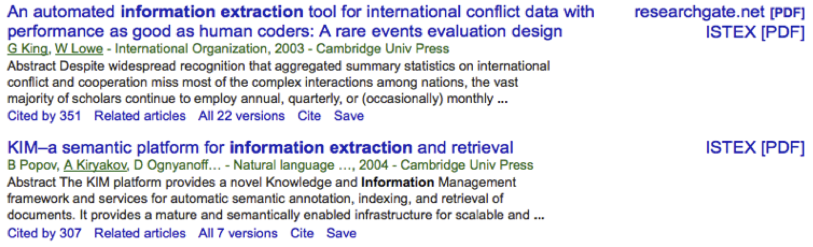

#Activation of links to ISTEX in Google Scholar

##Principal

Google Scholar allows the integration of OpenURL links to full text resources contextualized with the electronic subscriptions associated to a geiven affiliation. 

The integration of these links to ISTEX resources follows these steps:

1) __Description of the ISTEX holding__ thanks to Kbart files available with the BACON services (provided by ABES) in JSON and XML format. For example:  

* to get the complete list of packages available in BACON in json: 

https://bacon.abes.fr/list.json

* to get the description of a particular package in XML format : 

https://bacon.abes.fr/package2kbart/NPG_FRANCE_ISTEXJOURNALS.xml 

2) __Converting the ISTEX holding description__ from the Kbart XML format into the Google Scholar XML format defined at the following link : 
https://scholar.google.com/intl/en/scholar/institutional_holdings.xml 

This is done by an XSLT style sheet applied to the Kbart files obtained via BACON for each ISTEX package. 

3) __Creation of the Google Scholar form__ for requesting the activation of the OpenURL links, also in XML :
https://scholar.google.com/intl/en/scholar/institutional_links.xml 

This form will refer to the XML documents created at the step 2.

The files ```institutional_links.xml``` and ```institutional_holdings.xml``` for ISTEX can be validated by the dedicated DTD provided by Google. 

4) __Submission of the form___. The Google Scholar XML documents describing the holding in XML format are exposed on a web server. The URL of the main filled form file (```institutional_links.xml```) is sent by email to Google Scholar via their  address for support:
https://support.google.com/scholar/contact/general 

Google Scholar indicates that the activation (and update) takes one to two weeks. 

5) __Activation__ : 

After the setting by the user of his ISTEX affiliation in the Google Scholar settings, the links to the ISTEX full texts will appear on the right side of the search results, for instance :



6) __Update__ : the ISTEX holding description files can be regenerated by following the previous steps. It is only needed to replace the XML files exposed on internet and the Google Scholar crawler will take into account the new versions.  

7) Here are some additional possible complementary elements doable by the [ISTEX Browser Addon](https://github.com/istex/istex-browser-addon) :

* Automatic setting of the _library links_ affiliation in Google Scholar

* Standard "button" for accessing the ISTEX full texts (actually it's not really a button, simply decorated text easier to catch for a user and faster to render than bitmap) instead of the default Google Scholar text link, in order to have a consistent visual indication independently from the visited web site. 

## Build and run

The goal of the present node.js module is to automate all the previously described steps in one single command line. 
Each execution of the module will makepossible to update the Google Scholar library links and the different settings. 

Install :

> npm install

Require: node_xslt, https

Run : 

> node main

The holding description files in Google Scholar XML format are produced under the folder ```results/```.

## Testing Google Scholar OpenURL links

OpenURL links generated by Google Scholar are available under ```test/google-scholar-openurls.txt``` in order to test the OpenURL service of the ISTEX API.

## Modifying the affiliation data in the activation form

The "root" file for the XML ISTEX holding description gives the following affiliation information: name the affiliation, keywords for the affiliation, email contacts, and labels for the links. This can be modified in the file  ```resources/institutional_links_istex.xml``` under the elements respectively ```<institution>```, ```<keywords>```, ```<contact>``` and ```<electronic_link_label>```. The final description files will use these updated information.  

The OpenURL service address to be used is also indicated in the file  ```resources/institutional_links_istex.xml``` under the element ```<openurl_base>```. Good to note, the base URL for the OpenURL service can include default options (or be prefixed by the url of an authentication proxy), for instance:  

```xml
	<openurl_base>https://api.istex.fr/document/openurl?mode=auth&</openurl_base>
``` 

Note : ```<other_link_label>``` is not used in our case, because the ISTEX resources are only digital. 

## Other informations

The links generated by Google Scholar follow __OpenURL 0.1__ and not OpenURL 1.0! 
It is thus necessary that an OpenURL 1.0 service having to manage the Google Scholar OpenURL also incluse a fallback to 0.1 (for instance in case of a ```sid=google&``` present in the OpenURL).

__Cancel the holding description_ / removing the Google Scholar library links. Two solutons :

* either simply remove the holding description files previously exposed in internet ("Once the information is no longer available to us, we will stop using it within 30 days.")

* send a manual request via https://support.google.com/scholar/contact/general
